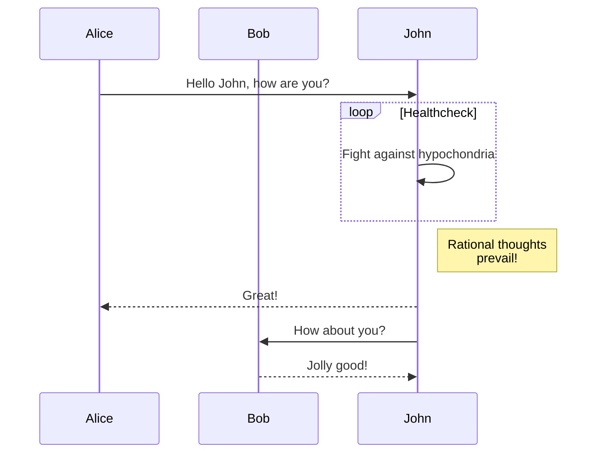
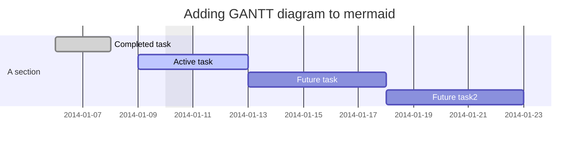

# 说明

## 编辑器

### 顶部工具条


|  图标  |  说明  | 快捷键_pc| 快捷键_mac| 
|  -  |  -  |  -  | - |
|  <i class="fas fa-book"></i>  | 展开\|关闭TOC页面(手机端\|全屏时不可见)   |   
|  <i class="far fa-square"></i>  |  是否打开辅助工具条   |     
|  <i class="fas fa-upload"></i>  |  保存当前文档到本地   |     
|  <i class="fas fa-download"></i>  |  加载本地文档到编辑器   |  
|  <i class="far fa-file"></i>  |  新建一篇文档   |  
|  <i class="fas fa-search"></i>  |  打开搜索框   | <kbd>Alt</kbd> <kbd>S</kbd> | <kbd>Ctrl</kbd> <kbd>S</kbd>
|  <i class="fas fa-cog"></i>  |  打开主题配置   |   
|  <i class="fas fa-expand"></i>  |  进入全屏模式   | <kbd>Ctrl</kbd> <kbd>Enter</kbd>   |<kbd>Cmd</kbd> <kbd>Enter</kbd>   |
|  <i class="fas fa-compress"></i>  |  退出全屏模式   |  <kbd>Esc</kbd> | <kbd>Esc</kbd>|

### 辅助工具条

|  图标  |  说明  | 快捷键_pc| 快捷键_mac| 
|  -  |  -  |  -  |  -  | 
|  <i class="far fa-grin-alt"></i>  | 插入emoji  |   
|  <i class="fas fa-heading"></i>  |  插入heading   |  <kbd>Ctrl</kbd> <kbd>H</kbd>   |<kbd>Ctrl</kbd> <kbd>H</kbd>   |
|  <i class="fas fa-bold"></i>  |  文字加粗   |   <kbd>Ctrl</kbd> <kbd>B</kbd>   | <kbd>Ctrl</kbd> <kbd>B</kbd>   |   
|  <i class="fas fa-italic"></i>  |  文字倾斜  |   <kbd>Ctrl</kbd> <kbd>I</kbd>   |<kbd>Ctrl</kbd> <kbd>I</kbd>   |
|  <i class="fas fa-quote-left"></i>  |  引用   | <kbd>Ctrl</kbd> <kbd>Q</kbd>   |<kbd>Ctrl</kbd> <kbd>Q</kbd>   |
|  <i class="fas fa-strikethrough"></i>  |  将文字标记为删除   |
|  <i class="fas fa-link"></i>  |  插入超链接   | <kbd>Ctrl</kbd> <kbd>L</kbd>   |<kbd>Ctrl</kbd> <kbd>L</kbd>   |
|  <i class="fas fa-code"></i>  |  插入代码(inline)   | 
|  <i class="fas fa-file-code"></i>  |  插入代码块   | <kbd>Alt</kbd> <kbd>B</kbd> |<kbd>Shift</kbd> <kbd>Cmd</kbd> <kbd>B</kbd>   |   |
|  <i class="far fa-square"></i>  |  插入todo(未完成)   | <kbd>Alt</kbd> <kbd>U</kbd> |<kbd>Shift</kbd> <kbd>Cmd</kbd> <kbd>U</kbd> |
|  <i class="far fa-check-square"></i>  |  插入todo(已完成)   | <kbd>Alt</kbd> <kbd>I</kbd>| <kbd>Shift</kbd> <kbd>Cmd</kbd> <kbd>I</kbd> |
|  <i class="fas fa-table"></i>  |  插入表格   | <kbd>Alt</kbd> <kbd>T</kbd> |<kbd>Shift</kbd> <kbd>Cmd</kbd> <kbd>T</kbd> |
|  <i class="fas fa-undo"></i>  |  undo   |   <kbd>Ctrl</kbd> <kbd>Z</kbd>   |<kbd>Cmd</kbd> <kbd>Z</kbd> |
|  <i class="fas fa-redo"></i>  |  redo   |  <kbd>Ctrl</kbd> <kbd>Y</kbd>   | <kbd>Cmd</kbd> <kbd>Y</kbd> |
|  <i class="fas fa-times"></i>  |  暂时关闭辅助工具条   |  

### 全屏

通过点击顶部工具条  <i class="fas fa-expand"></i> 图标，或者通过快捷键进入全屏模式

在全屏模式下  
位于编辑器页面，通过 <kbd>Ctrl</kbd> <kbd>-></kbd>(pc) | <kbd>Cmd</kbd> <kbd>-></kbd>(mac)进入预览页面  
位于编辑器页面，通过 <kbd>Ctrl</kbd> <kbd>&lt;-</kbd>(pc)| <kbd>Cmd</kbd> <kbd>&lt;-</kbd>(mac)进入TOC页面  
位于预览页面，通过 <kbd>Ctrl</kbd> <kbd>&lt;-</kbd>(pc)| <kbd>Cmd</kbd> <kbd>&lt;-</kbd>(mac)进入编辑器页面  
位于TOC页面，通过 <kbd>Ctrl</kbd> <kbd>-></kbd>(pc)| <kbd>Cmd</kbd> <kbd>-></kbd>(mac)进入编辑器页面 

再次点击 <i class="fas fa-expand"></i> 图标 或者通过 <kbd>Esc</kbd> 退出全屏


### 导出

在预览页面右击，会出现导出选项

#### markdown

直接下载markdown文本文件

#### html
导出html**片段**，不能直接用于浏览，只能用于嵌入

#### Styled Html
导出带样式的HTML，可用于直接浏览

***Katex 采用了cdn的方式引入，因为它引用了大量字体文件***


#### PDF

通过chrome浏览器的打印功能来实现

##### 强制分页
通过添加以下代码可以让pdf文件强制分页
```html
<div style="page-break-after: always;"></div>
```

#### 存在的问题
1. 导出Styled Html时，默认宽度为100%，但由于mermaid会根据当前视窗调整大小，可能不适用于其他不同尺寸的屏幕的显示
2. mermaid  `Class diagram`和 `Git graph`导出存在异常(8.2.3版本)

### 手机端

在手机端时：
位于编辑器页面，通过 *向右滑动* 进入预览页面  
位于编辑器页面，通过 *向左滑动* 进入TOC页面  
位于预览页面，通过 *向左滑动* 进入编辑器页面  
位于TOC页面，通过 *向右滑动* 进入编辑器页面

## markdown语法

### 标题

|  markdown  |  html   |    
|  -  |  -  |
|  `# 一级标题`  |  <h1>一级标题</h1>  |  
|  `## 二级标题`  |  <h2>二级标题</h2>  |     
|  `### 三级标题`  | <h3>三级标题</h3>   |    
|  `#### 四级标题`  | <h4>四级标题</h4>   |    
|  `##### 五级标题`  | <h5>五级标题</h5>   |    
|  `###### 六级标题`  |<h6>六级标题</h6>    |   

### 字体

|  markdown  |  html   |    
|  -  |  -  |
|  `**加粗**`  |  **加粗**  |  
|  `*斜体*`  |  *斜体*  |   
|  `***斜体加粗***`  |  ***斜体加粗***  |  
|  `~~删除线~~`  |  ~~删除线~~  |  

### 引用

|  markdown  |  html   |    
|  -  |  -  |
|  `> 文字`  |  <blockquote><p>123</p></blockquote>  |  

### 分割线

|  markdown  |  html   |    
|  -  |  -  |
|  `---`  |  <hr>  | 
|  `***`  |  <hr>  | 

### 图片

|  markdown  |  html   |    
|  -  |  -  |
|  `')`  |    | 

### 超链接
|  markdown  |  html   |    
|  -  |  -  |
|  `https://md.qyh.me`  | https://md.qyh.me  | 
|  `[超链接名](超链接地址 '超链接title(可选)')`  | [heather](https://md.qyh.me 'heather')  | 

### 列表
|  markdown  |  html   |    
|  -  |  -  |
|  <pre> - 无序列表 <br> - 无序列表 </pre>  | <ul><li>无序列表</li><li>无序列表</li></ul>  | 
|  <pre> 1. 有序列表 <br> 2. 有序列表 </pre>  | <ol><li>列表内容</li><li>列表内容</li></ol>  | 
|  <pre> - 嵌套列表<br>    - 嵌套列表<br>    - 嵌套列表<br>        1. 嵌套列表<br>        2. 嵌套列表<br></pre> | <ul><li>嵌套列表<ul><li>嵌套列表</li><li>嵌套列表<ol><li>嵌套列表</li><li>嵌套列表</li></ol></li></ul></li></ul>   | 

### 表格
|  markdown  |  html   |    
|  -  |  -  |
|  <pre>\|表头\|表头\|表头\|<br>\|--\|:--:\|--:\|<br>\|内容\|内容\|内容\|<br>\|内容\|内容\|内容\|</pre> | <table><thead><tr><th style="text-align:left">表头</th><th style="text-align:center">表头</th><th style="text-align:right">表头</th></tr></thead><tbody><tr><td style="text-align:left">内容</td><td style="text-align:center">内容</td><td style="text-align:right">内容</td></tr><tr><td style="text-align:left">内容</td><td style="text-align:center">内容</td><td style="text-align:right">内容</td></tr></tbody></table> | 

### 代码
|  markdown  |  html   |    
|  -  |  -  |
|  ``` `code` ```  | `inline code`  | 
|  <pre>\```language<br>block code<br>\```</pre>  | <pre><code>block code</code></pre> | 

### mermaid

#### 流程图

<pre>

</pre>


#### 时序图

<pre>

</pre>

#### 甘特图

<pre>


</pre>


更多请参考：https://mermaidjs.github.io/#/

### katex

#### 行内公式


```
$\Gamma(n) = (n-1)!\quad\forall n\in\mathbb N$
```

#### 公式块
```
$$
\Gamma(z) = \int_0^\infty t^{z-1}e^{-t}dt\,.
$$
```

更多请参考 http://meta.math.stackexchange.com/questions/5020/mathjax-basic-tutorial-and-quick-reference